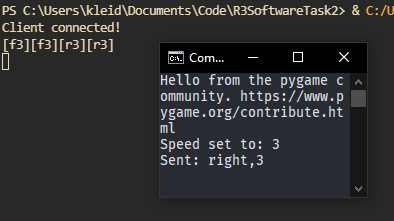

# R3-SoftwareTask2-KleidiBujari

### By: Kleidi Bujari // kbujari@ryerson.ca

### Example Output

**Note:** Output when "D" is pressed and speed is set to 3.

## Links
- [Video of Project]()

## The Project

The project aims to send data packets containing direction and speed information to send to a server, which in this scenario is a rover that needs to be controlled over TCP. 

### Technical Description

Input is captured by a library called [PyGame](https://www.pygame.org/docs/) and processed into packets, which are sent over the Python socket library, where they are decoded from bytes back into UTF-8 strings, and used to output instructions for the "rover." 